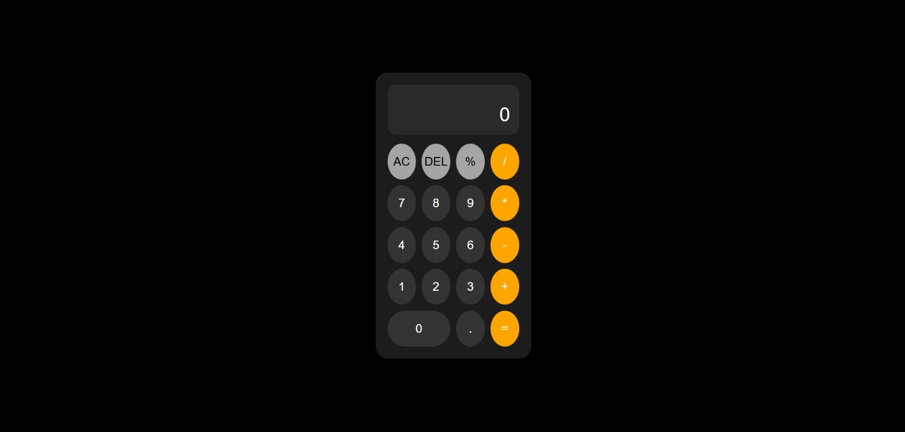

#  Calculator 

A simple and clean **Calculator web application** built using HTML, CSS, and JavaScript. Supports basic arithmetic operations with expression history and a modern dark-themed UI.

---

##  Features

* Basic arithmetic operations — Addition, Subtraction, Multiplication, Division, Modulus
* Expression history display
* Delete last entry with DEL button
* Clear all with AC button
* Decimal point support
* Dark-themed UI with circular buttons
* Smooth hover effects on buttons

---

##  Technologies Used

* HTML
* CSS (Grid layout, Flexbox)
* JavaScript (DOM manipulation, Event listeners)

---

##  Screenshot



---

##  How to Run

1. Clone the repository:

```bash
git clone https://github.com/jeyakeerthanad/Calculator_project.git
```

2. Navigate into the folder:

```bash
cd Calculator_project
```

3. Open in browser:

```bash
start calc.html
```

---

##  Project Structure

```
Calculator_project/
│── calc.html
│── calc.css
│── calc.js
│── README.md
│── Calculator_Screenshot.jpeg
```

---

##  How It Works

* User clicks buttons to build an expression
* Expression and operator shown in history display
* Result shown in main display
* `=` evaluates and shows the final result
* `AC` clears everything and resets
* `DEL` removes the last entered character

---

##  License

This project is open-source and free to use.

---

##  Author

Developed by [@jeyakeerthanad](https://github.com/jeyakeerthanad)
